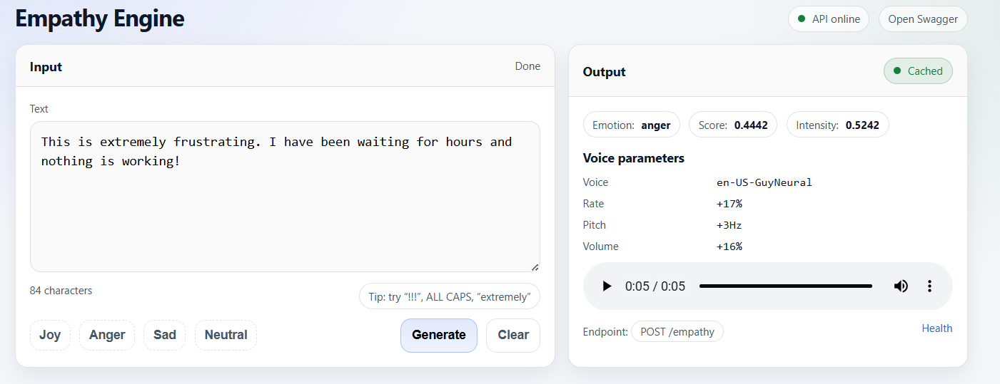

# The Empathy Engine

The **Empathy Engine** is a FastAPI service that takes text input, detects the **emotion** in the text, and generates **expressive speech** by modulating **voice parameters** (rate, pitch, volume) using **Edge-TTS**.  
It outputs a **playable `.wav`** file and provides a simple web UI for instant demo.


## Features Implemented

✅ **Text Input** via API + Web UI  
✅ **Emotion Detection** using a Hugging Face emotion classifier (7 emotion labels)  
✅ **Granular Emotions** (joy, anger, sadness, fear, surprise, disgust, neutral)  
✅ **Intensity Scaling** using model confidence + punctuation/caps/intensifiers  
✅ **Voice Parameter Modulation** (Rate + Pitch + Volume)  
✅ **Emotion → Voice Mapping** with clear rules per emotion  
✅ **WAV Output** (`riff-24khz-16bit-mono-pcm`)  
✅ **Caching** (same input + params returns same saved WAV)  
✅ **Cleanup Endpoint** to delete old generated WAV files


## Tech Stack

- **FastAPI** (API server)
- **Edge-TTS** (Text-to-Speech engine)
- **Hugging Face Transformers** (emotion classifier)
- **Torch (CPU)** (for running the transformer model locally)
- **Jinja2** (serving the demo UI)

## Project Structure

```
project/
├─ app/
│  ├─ main.py
│  ├─ emotion.py
│  ├─ mapping.py
│  ├─ cache.py
│  ├─ tts_router.py
│  └─ ui_router.py
│
├─ templates/
│  └─ index.html
│
├─ outputs/        # Generated WAV files are saved here
│
└─ README.md
```

## Setup Instructions (Windows)

### 1) Create and activate a virtual environment
```powershell
python -m venv .venv
.\.venv\Scripts\activate
```

---


### 2) Install dependencies
```powershell
pip install -r requirements.txt
```

---


### 3) Run the application
```powershell
uvicorn app.main:app
```

The app will start at:
```
http://127.0.0.1:8000
```

---

## User Interface




- Generated audio files are saved in the `outputs/` directory


## Design Choices

This section explains the key architectural and design decisions behind the system.

<p align="center">
  
</p>


### 1) Why Edge-TTS

Edge-TTS provides **high-quality neural voices for free** and supports programmatic control over:

- **Rate**
- **Pitch**
- **Volume**

---

### 2) Emotion Detection Approach (Granular Emotions)

Instead of limiting emotion detection to **Positive / Negative / Neutral**, we use a **pretrained transformer model** that outputs **7 emotion classes**:

- joy  
- anger  
- sadness  
- fear  
- surprise  
- disgust  
- neutral  

This finer granularity makes the system feel **more human-like** and enables **more meaningful and expressive voice modulation**.

---

### 3) Intensity Scaling Logic

Emotion expression is not only about *which emotion* is detected, but also *how strong* it is.

We compute intensity in two stages:

**Base intensity**
```
base_intensity = model confidence score (0.0 – 1.0)
```

**Heuristic boosts**
The base score is then adjusted using linguistic signals:

- Exclamation marks (`!!!`) → increase intensity  
- Question marks (`???`) → mild increase  
- ALL CAPS words (`BEST`, `NOW`) → increase intensity  
- Elongated words (`soooo`) → increase intensity  
- Intensifiers (`very`, `extremely`, `absolutely`) → increase intensity  

Finally, intensity is **clamped to `[0, 1]`** to prevent extreme outputs.

**Example**
- `"This is good."` → mild modulation  
- `"THIS IS THE BEST NEWS EVER!!!"` → strong modulation  

---

### 4) Emotion → Voice Parameter Mapping

Each emotion maps to a **direction of change** in speech parameters.  
The **final values are scaled by intensity**.

#### General rules

- **Joy / Surprise**
  - Faster rate
  - Higher pitch
  - Slightly louder volume

- **Sadness**
  - Slower rate
  - Lower pitch
  - Softer volume

- **Anger**
  - Faster rate
  - Louder volume
  - Slight pitch variation

- **Fear**
  - Higher pitch
  - Slightly faster rate
  - Near-neutral volume

- **Neutral**
  - No modulation

#### Example (conceptual ranges)

- **Joy**
  - Rate: `+10% → +28%`
  - Pitch: `+12Hz → +48Hz`
  - Volume: `+4% → +14%`

- **Sadness**
  - Rate: `-8% → -22%`
  - Pitch: `-10Hz → -40Hz`
  - Volume: `-2% → -10%`

This approach ensures:

- Deterministic and explainable behavior  
- Expressive but controlled output  
- No unnatural or extreme voice shifts  

---

### 5) Caching Strategy (Performance Optimization)

Generating speech repeatedly for the same input wastes time and resources.

We compute a **stable cache key** based on:

- Input text
- Chosen voice parameters
- Output format

If an identical request is received again:

- The previously generated `.wav` file is returned instantly
- The response includes `cached: true`

This significantly improves responsiveness and scalability.

---

## Limitations

- Edge-TTS supports **rate, pitch, and volume** well, but advanced SSML features  
  (e.g., `<phoneme>`, `<emphasis>`, `<break>`) are limited under the Edge-only constraint.
- The **first request after server startup** may be slower because the transformer
  model is loaded into memory once.

---
